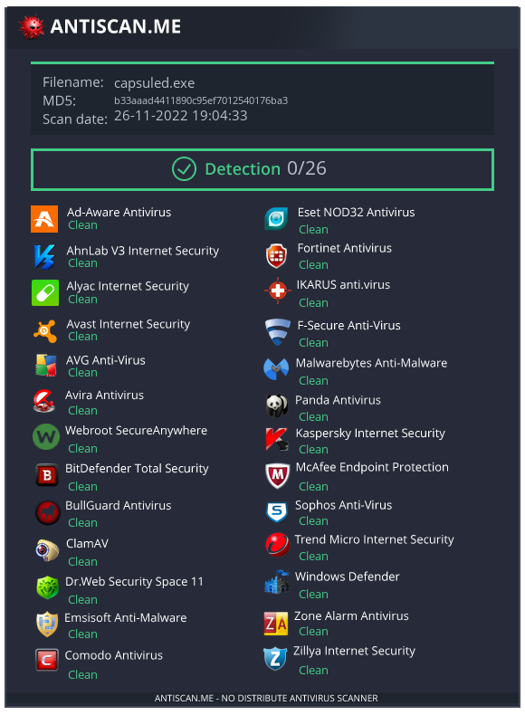

# Capsule

Capsule is a tool designed to bypass anti-virus solutions.
This project uses various evasion techniques and protects the payload from anti-virus solutions.
It's 26.11.2022 and it's fully undetected (FUD)



## Software Requirements

* Windows 10 (Other windows versions may work too I didn't test them.)
* Build Tools for Visual Studio (cl.exe)
* Python3
* Python library pycryptodome

## Setup

After installing requirements download and extract the files.

## Notes

* Capsule currently only works on spawn to thread payloads
* You can test if it works with calc64_thread.bin file in tests directory.

## Usage

In x64 Native Tools Command prompt
```
python capsule.py yourpayload.bin
cd build
compile.bat
```

Output will be capsuled.exe in build directory.